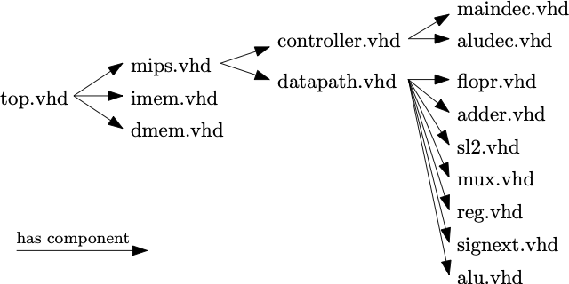
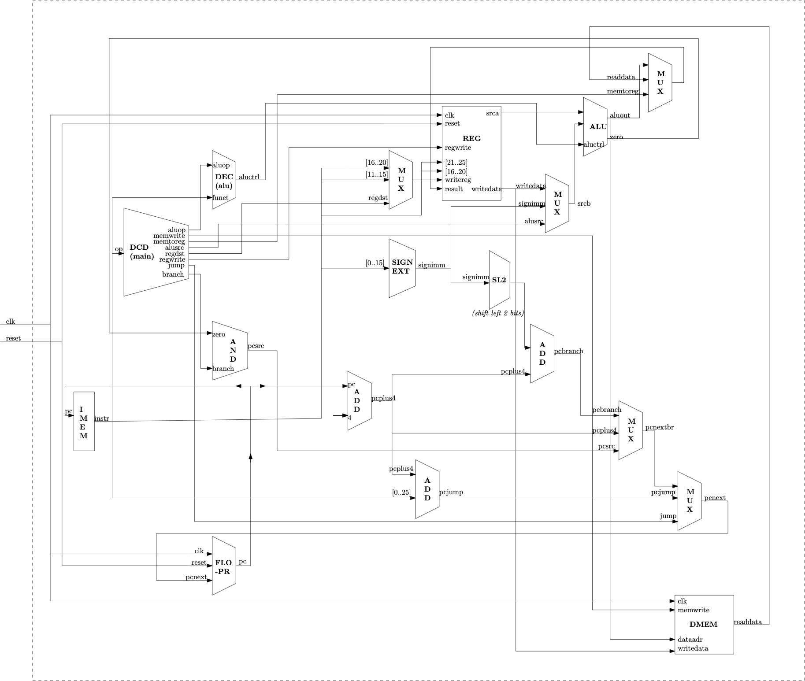

This is a repository for the project Entwurf, Realisierung und Programmierung eines Mikrorechners.

Authors: Jasper Schwarzwald, Benedikt Ostendorf, Anran Wang

The report source files and pdf file can be found in ./ausarbeitung

The implementation can be found in ./implementation

The structure of the implementation is as follows: 

The detail of the CPU is show in this figure:

